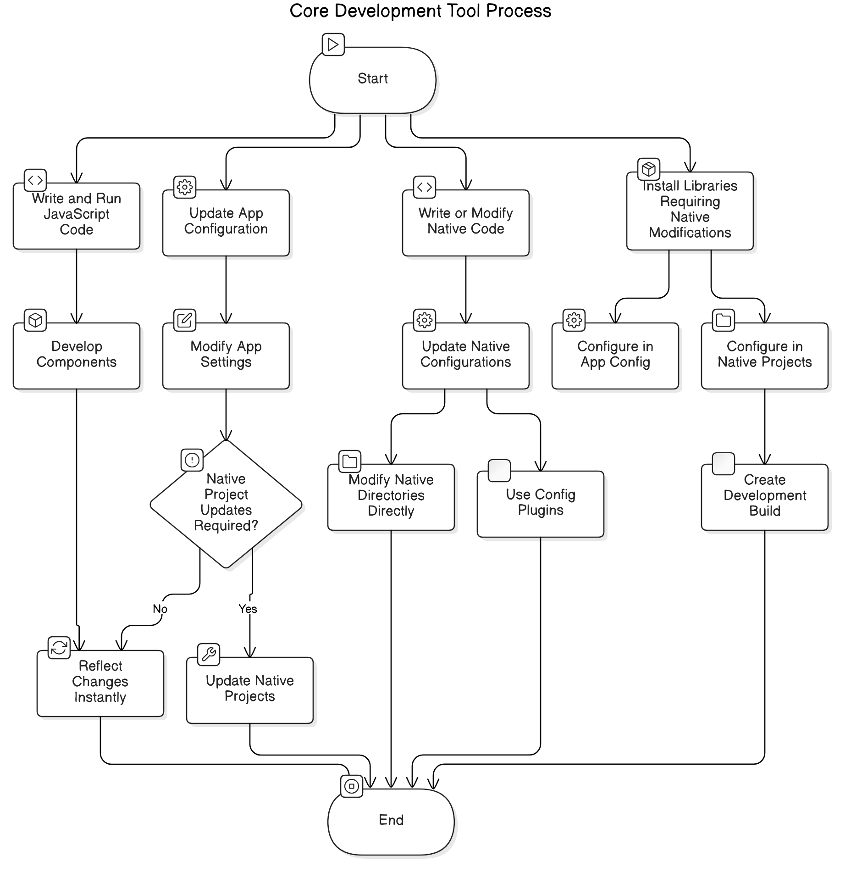

!!! A small research on Expo vs React Native CLI. Which one should i proceed
with from Perplexity!!!
Refer [React Native CLI vs Expo.md](./React Native CLI vs Expo.md)

# Crash Course on React Native

## What is React Native?

> Develop application for IOS, Android and Web from single codebase

Use native components
- Better Performance
- More seamless UX

Also, Hot reloading or `Over-the-air-updates` and Strong community support is available which will boost
up the developer experience.

## What is Expo?
Expo is similar to create-react-app and vite that provides many tools and
services that simplify the development process so no need to configure -
- Dev environment
- Native dependencies

Expo offers pre-built components & APIs for
- Navigation
- Gestures
- Camera
- Maps
---

## Similarity between React Native and React
When Coding in React Native, we use Javascript like React JS
> but instead of rendering HTML elements, you'll be rendering native mobile
> components

```jsx
import React from 'react'
// import React Native components
import { View, Text } from 'react-native'

// Creating functional components
const App = () => {
  return (
  <View>
    <Text>Hello World</Text>
  </View>
  )
}
```

> Looking into the Text component
```jsx
<Text
  style = {{ fontsize: 24, color: 'blue' }}
>Hello World</Text>
```
This is similar to p or h1 tag to render text

## Styling in React Native
> React Native offers a stylesheet utility that helps us to define styles by
> creating a single JavaScript object that optimizes performance

> Nativewind: allows to write tailwind like styles within react native

## `<View>` Component

- A box or container that holds other components that is similar to `<div>`
element in HTML but with some added functionality specific to mobile apps
- used to create layout structures for other components
- has many different props that can be used to control its appearance and
behavior 

> `<View>` uses flexbox layout by default that makes it easier to control how
> its child components are laid out within the container

flexbox properties can be used here - flex-direction, justify-content or
align-items to achieve the layout desired

## Touchable Components
### `<TouchableOpacity>` Component


```jsx
import React from 'react'
// import React Native components
import { TouchableOpacity, Text } from 'react-native'

// Creating functional components
function MyButton(props){
  return (
    <TouchableOpacity onPress={props.onPress}>
      <Text>{props.label}</Text>
    </TouchableOpacity>
  )
}
```

- Like a Cousin to `<Button>` Component but with more customization and
flexibility

### `<TouchableHighlight>` Component

- Allows Views to respond to touch in a Unique way that when touched the
component reduces the opacity of the wrapped view revealing an underlay color

### `<TouchableWithoutFeedback>` Component

- Helps to create an element that is Clickable without visual feedback when
pressed that is useful for creating link or images that don't require any
additional styling or effects

## `<ActivityIndicator` Component

- Allows to show spinner or a loading indicator in the app

## `<Button>` Component

- Allows to set properties like title, color and onPress function to be called
when pressed

## `<Flatlist>` Component

- Helps to render a long list of items that needs to be scrolled efficiently
like the map function in React but has extra features like optimized scroll
performance and item separation 

> `<Flatlist>` => For larger lists with smooth scrolling
> Map function => For smaller lists

## `<ScrollView>` Component

- A magic box that can hold multiple components and views, providing a scrolling
  container for them like Overflow scroll property of a `div` in HTML allowing us to easily navigate through a list of items or a large amount of content within the app

## `<SafeAreaView>` Component

- Provides a Safe zone to render apps content without being covered by the
device's hardware features like the notch, home indicator or status bar to
support devices with different screen sizes and shapes

> This is not optimized for all devices so instead of the default native
> component, we can use it from the library > `react-native-safe-area-context`
> to ensure content is contained within the safe area on any mobile device
> preventing overlap with a notch or bottom navigation bar

## `<Image>` Component

- Display image

## `<ImageBackground>` Component
- Display image as background of a container allowing other components to
layered on top of it

> SVG is not supported by both the default components so a third party library
> has to be utilized > `react-native-svg`

---
-- React native has many ready-made components such as
- Modal
- Alert
- Switch (Toggle)
- StatusBar
and many more...

# Diving into Expo

~ A React Native app utilizing Expo tools (e.g., Expo SDK, CLI, Router)

## Expo tools
- Expo Open Source Tools:
  - Includes Expo CLI, Router, SDK, etc.
  - Free and MIT-licensed
- Expo Application Services (EAS):
  - Cloud-based services for app building, submission and updates
  - **Benefits** Automation, collaboration, and physical infrastructure (e.g.,
  servers, CDNs).

## Flexibility of Expo
- Use native tools like Fastlane or host your infrastrucure
- EAS integrates deeply with various Expo services, providing a seamless
workflow

## Development Workflows

### Expo Go vs Development Builds
- Expo Go:
  - Quick Prototype testing.
  - Not for production apps.
- Development Builds:
  - Debug builds with `expo-dev-client`.
  - Allows configuration of native libraries and features.
  - Created locally or with EAS build.

### Continous Native Generation (CNG)
- Native projects generated dynamically from app.json and package.json

+++ Advantages
- Simplifies updates and maintenance
- Easily re-generate native projects with `npx expo prebuild`
- Supports advanced features via config plugins

## Core Development Loop



> 1. Write and Run Javascript code:
> > - Develop components and business logic.
> > - Reflect changes instantly without native interaction
> 2. Update App Configuration:
> > - Modify app settings via app.json and app.config.js
> > - Changes may require native project updates
> 3. Write or Modify Native Code:
> > - Update native configurations or add native dependencies
> > Approaches:
> > > - Modify native directories easily.
> > > - Use config plugins for better maintainability.
> 4. Install Libraries requiring native modifications:
> > - Libraries may need configuration in app config or directly in native
> >   projects
> > - Requires creating a development build

## Development Workflows: Cloud vs Local
### Cloud-Based (EAS Build)
+++Benefits:
- No need for Android studio/Xcode
- Easily share builds with stakeholders
- Usage: Run `eas build` to compile your app

### Local Development
- Requirements: Install Android studio/Xcode
- Commands:
  - `npx expo run:android|ios` for builds
  - Modify or debug directly on native directories.


| **Component**        | **Description**                                                                 | **Attributes**                                                                                         | **When to Use Them**                                                                                     | **React Equivalent**               |
|-----------------------|---------------------------------------------------------------------------------|--------------------------------------------------------------------------------------------------------|----------------------------------------------------------------------------------------------------------|-------------------------------------|
| **Text**             | Displays text on the screen.                                                   | `style`, `numberOfLines`, `onPress`                                                                   | When you need to show simple text or clickable text.                                                     | `<Text>`                           |
| **View**             | A container for other components or layouts.                                   | `style`, `onLayout`, `accessibilityProps`                                                             | To organize UI elements into sections or create layouts.                                                | `<div>` (HTML)                     |
| **Image**            | Displays images in your app.                                                   | `source`, `style`, `resizeMode`                                                                       | When you need to show images like logos, icons, or photos.                                               | `` (HTML)                     |
| **ScrollView**       | A scrollable container for long content.                                        | `contentContainerStyle`, `horizontal`, `onScroll`                                                     | For scrolling through content, like lists or long forms.                                                 | `<div>` with CSS scroll            |
| **Button**           | A simple button component.                                                     | `title`, `onPress`, `color`                                                                           | For basic button interactions like submit, cancel, etc.                                                  | `<button>`                         |
| **TextInput**        | Input field for text entry.                                                    | `placeholder`, `onChangeText`, `value`, `keyboardType`                                                | For user input like forms, search boxes, or login fields.                                                | `<input>`                          |
| **FlatList**         | Optimized list for rendering large datasets.                                   | `data`, `renderItem`, `keyExtractor`, `horizontal`                                                    | When you need a scrollable list of items with better performance for large data.                         | `<ul>` or custom list mapping      |
| **SectionList**      | Displays lists with sections and headers.                                      | `sections`, `renderItem`, `renderSectionHeader`, `keyExtractor`                                       | To display grouped data with headers, like a directory or categories.                                    | Custom implementation with `<ul>`  |
| **SafeAreaView**     | Ensures content is rendered within safe areas (like avoiding notches).          | `style`, `edges`                                                                                      | When you want content to avoid overlapping system UI (e.g., notch, status bar).                          | No direct React equivalent          |
| **ActivityIndicator**| Displays a loading spinner.                                                    | `size`, `color`, `animating`                                                                          | To indicate that a process (like loading or fetching data) is in progress.                               | Custom spinner component            |
| **TouchableOpacity** | A touchable component that reduces opacity on press.                           | `onPress`, `style`, `activeOpacity`                                                                   | For interactive elements like buttons or links that need feedback.                                       | `<button>`                         |
| **Modal**            | Displays content in a popup modal view.                                        | `visible`, `onRequestClose`, `transparent`, `animationType`                                           | To show dialogs, popups, or temporary information.                                                       | `<div>` with conditional rendering |
| **ImageBackground**  | Displays an image as a background for a component.                             | `source`, `style`, `resizeMode`                                                                       | When you need a background image for a section or component.                                             | `<div>` with CSS background         |
| **Video (expo-av)**  | Plays video content.                                                           | `source`, `style`, `resizeMode`, `shouldPlay`, `isLooping`                                            | For embedding video playback in your app.                                                                | `<video>`                          |
| **Audio (expo-av)**  | Plays audio files.                                                             | `source`, `volume`, `isPlaying`, `onPlaybackStatusUpdate`                                             | When adding audio to your app, like music, notifications, or podcasts.                                   | No direct React equivalent          |
| **Camera (expo-camera)** | A component to access the device's camera.                                    | `type`, `flashMode`, `onCameraReady`, `onBarCodeScanned`                                              | When building camera-based features like scanning QR codes or taking photos.                             | No direct React equivalent          |
| **MapView (expo-maps)** | Displays interactive maps.                                                    | `initialRegion`, `region`, `onPress`, `onMarkerPress`                                                 | When you need map features, like showing locations or directions.                                        | Google Maps API or Leaflet          |
| **LinearGradient (expo-linear-gradient)** | Creates a gradient background.                                               | `colors`, `start`, `end`, `locations`, `style`                                                        | For visually appealing gradient backgrounds or effects.                                                  | CSS gradients                      |
| **Animated**         | Provides animation capabilities for components.                                | `useNativeDriver`, `timing`, `value`                                                                  | When you need animated transitions, movements, or effects.                                               | React Spring, Framer Motion         |
| **SVG (expo-svg)**    | Renders Scalable Vector Graphics (SVG).                                        | `width`, `height`, `viewBox`, `fill`                                                                  | To add scalable icons, shapes, or illustrations to your app.                                             | React-SVG                          |
| **Haptics (expo-haptics)** | Provides tactile feedback on user interactions.                            | `impactAsync`, `selectionAsync`, `notificationAsync`                                                  | When you want to enhance user interactions with physical feedback (like vibrations).                     | No direct React equivalent          |
| **Permissions (expo-permissions)** | Handles runtime permissions for accessing device features.                               | `askAsync`, `getAsync`                                                                                | When working with sensitive features like camera, microphone, or location that need user permission.     | No direct React equivalent          |
| **Constants (expo-constants)** | Accesses app and device constants.                                                  | `manifest`, `systemFonts`, `platform`                                                                 | For getting system-level information, like device type or app version.                                   | No direct React equivalent          |
| **FileSystem (expo-file-system)** | Provides access to the device's file system.                                       | `readAsStringAsync`, `writeAsStringAsync`, `deleteAsync`, `getInfoAsync`                              | When you need to handle file storage, like saving data or caching images.                                 | Node.js File System APIs            |
| **Notifications (expo-notifications)** | Manages push and local notifications.                                             | `scheduleNotificationAsync`, `dismissNotificationAsync`, `getExpoPushTokenAsync`                     | To send or schedule notifications for reminders or updates.                                               | Firebase Cloud Messaging            |
| **StatusBar**               | Configures the app's status bar appearance.                                                       | `backgroundColor`, `barStyle`, `hidden`, `translucent`                                                 | When customizing the status bar to match your app's theme.                                               | CSS and HTML meta tags             |
| **KeyboardAvoidingView**    | Adjusts UI when the keyboard appears.                                                             | `behavior`, `keyboardVerticalOffset`                                                                   | For forms or inputs that require proper alignment when the keyboard is active.                           | Custom layout adjustments          |
| **KeyboardDismissHandler**  | Dismisses the keyboard on tap outside input.                                                     | `onDismiss`                                                                                            | To enhance user experience when using text inputs in forms.                                              | Custom event handlers              |
| **WebView (expo-web-browser)** | Embeds a web browser view.                                                                        | `source`, `onLoad`, `onError`, `onNavigationStateChange`                                               | When you need to render web content or display a webpage in-app.                                         | React Native WebView               |
| **BlurView (expo-blur)**     | Applies a blur effect to views.                                                                   | `intensity`, `tint`, `style`                                                                           | For creating blurred backgrounds or overlays.                                                            | CSS filter blur                    |
| **GestureHandler (react-native-gesture-handler)** | Handles gestures like swipes, pinches, and drags.                                                   | `onGestureEvent`, `onHandlerStateChange`, `simultaneousHandlers`                                       | When implementing complex gestures in your app, like swiping cards or pinch-to-zoom.                     | React Spring/Framer Motion         |
| **Reanimated (react-native-reanimated)** | Advanced animation library for smooth gestures and interactions.                                   | `Animated.View`, `useSharedValue`, `useAnimatedStyle`                                                  | For high-performance and fluid animations in complex apps.                                               | React Spring/Framer Motion         |
| **PagerView (expo-pager-view)** | Allows swipeable horizontal pages.                                                                 | `initialPage`, `onPageSelected`, `orientation`                                                         | To implement page-based navigation like onboarding screens or carousels.                                 | React Swiper                       |
| **SecureStore (expo-secure-store)** | Stores sensitive data securely in encrypted storage.                                              | `setItemAsync`, `getItemAsync`, `deleteItemAsync`                                                      | When storing sensitive user data like tokens or passwords.                                               | Node.js Secure Store Libraries     |
| **Localization (expo-localization)** | Fetches device's locale and language preferences.                                                  | `locale`, `timezone`, `region`                                                                         | To implement internationalization or adapt the app's language based on user preferences.                 | Intl API                           |
| **Location (expo-location)** | Accesses device location data.                                                                       | `getCurrentPositionAsync`, `watchPositionAsync`, `requestPermissionsAsync`                             | When you need GPS features like maps, geofencing, or navigation.                                         | Geolocation API                    |
| **TaskManager (expo-task-manager)** | Allows background tasks like location tracking or fetching updates.                                    | `defineTask`, `startLocationUpdatesAsync`, `stopLocationUpdatesAsync`                                  | For background processing, such as location tracking or scheduled updates.                               | Web Workers                        |
| **BarCodeScanner (expo-barcode-scanner)** | Scans barcodes or QR codes.                                                                        | `onBarCodeScanned`, `type`, `style`                                                                    | When implementing QR code or barcode scanning features.                                                  | No direct React equivalent         |
| **ImagePicker (expo-image-picker)** | Lets users pick images from their device or capture new ones.                                        | `launchCameraAsync`, `launchImageLibraryAsync`, `mediaTypes`                                           | To allow users to upload photos or videos.                                                               | No direct React equivalent         |
| **Sharing (expo-sharing)**   | Enables file sharing from the app.                                                                   | `shareAsync`                                                                                           | For sharing files or content with other apps.                                                            | No direct React equivalent         |
| **Clipboard (expo-clipboard)** | Accesses the device's clipboard.                                                                     | `setStringAsync`, `getStringAsync`, `hasStringAsync`                                                   | When copying or pasting text or other data.                                                              | Clipboard API                      |
| **SplashScreen (expo-splash-screen)** | Configures and controls the app’s splash screen.                                                     | `preventAutoHideAsync`, `hideAsync`                                                                    | For showing a splash screen until your app has fully loaded.                                             | CSS and HTML splash implementation |
| **Linking**                  | Handles deep linking and external app navigation.                                                  | `openURL`, `canOpenURL`, `addEventListener`                                                            | When implementing deep linking or external URL handling.                                                 | No direct React equivalent         |
| **Updates (expo-updates)**   | Enables over-the-air updates for your app.                                                         | `fetchUpdateAsync`, `reloadAsync`, `checkForUpdateAsync`                                               | To deliver updates to your app without submitting a new app version to the store.                        | No direct React equivalent         |
| **Battery (expo-battery)**   | Monitors the device’s battery level and state.                                                     | `getBatteryLevelAsync`, `getBatteryStateAsync`, `addBatteryStateListener`                              | When you need to monitor battery usage or show a low battery warning.                                    | No direct React equivalent         |
| **Contacts (expo-contacts)** | Accesses the device's contacts list.                                                               | `getContactsAsync`, `addContactAsync`, `removeContactAsync`                                            | For apps that require contact management or integration, like messaging apps.                            | No direct React equivalent         |
| **DocumentPicker (expo-document-picker)** | Allows users to select files from their device.                                                       | `getDocumentAsync`, `copyToCacheDirectory`, `type`                                                     | When you need file upload functionality, such as document attachments.                                   | No direct React equivalent         |
| **MediaLibrary (expo-media-library)** | Accesses and manages the device's media files.                                                        | `getAssetsAsync`, `createAlbumAsync`, `deleteAssetsAsync`                                              | For apps that interact with the user’s photos or videos, like galleries or editors.                      | No direct React equivalent         |
| **Sensors (expo-sensors)**   | Accesses device sensors like accelerometer, gyroscope, and magnetometer.                            | `subscribe`, `setUpdateInterval`, `removeSubscription`                                                 | When building motion-based features like pedometers or augmented reality.                                | No direct React equivalent         |
